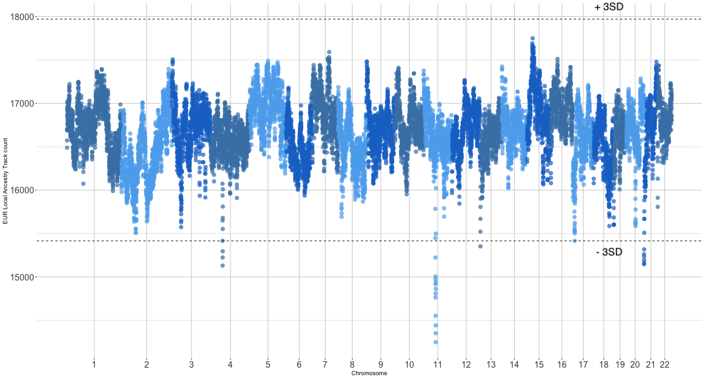

Local ancestry PheWAS pipeline
=================
NOTE: This file is a work in progress expected completion: 12/04/24

Citation: Cullina, S., Shemirani, R., Asgari, S. and Kenny, E.E., 2024. Systematic comparison of phenome-wide admixture mapping and genome-wide association in a diverse biobank. medRxiv, pp.2024-11.
DOI: https://www.medrxiv.org/content/10.1101/2024.11.18.24317494v1

Author: Sinéad Cullina

## Pipeline Summary ##

This pipeline calculates global ancestry, phases genotype data and subsets samples, runs local ancestry with GNOMIX, converts GNOMIX output to VCF files, compares local ancestry output to global ancestry proportions, filters samples and variants, and runs SAIGE for admixture mapping and fine-mapping. It also includes some post-processing steps and result plotting.

The pipeline consists of a series of scripts and commands. Below is the order of operations, commands and scripts used to conduct the main steps of the admixture PheWAS described in our paper. Submission scripts were developed and executed using the IBM LSF job scheduler on a CentOS Linux 7-based HPC system. 

I've made a toy dataset that you can use with these commands: https://drive.google.com/drive/folders/1J0xpkTBwyMI3MMCDRi24TPrpbuPQuQtn?usp=sharing

This toy dataset uses the thousand genomes (1KGP) and human genome diversity project (HGDP) whole genome sequencing data published here: https://pubmed.ncbi.nlm.nih.gov/38749656/. The dataset has been downsampled to include samples with the following population labels at a selection of Illumina Global Diversity Array (GDA) panel sites:

##### Potential Local Ancestry Inference (LAI) Reference Panel Samples #####
* European: CEU, TSI
* African: YRI, LWK
* Native American: Pima, Surui, Colombian,  Karitiana, Maya (all from HGDP), MXL, PUR


##### Populations with Recent Admixture for LAI #####
* CLM - Colombians from Medellín, Colombia (three-way admixture)
* ASW - African Ancestry in Southwest US (two-way admixture)

A mapper file with population labels for these samples called: sample_map_file_1kgp_hgdp.txt is also in the google drive.

## Pipeline Map: ##
#### 0) Global ancestry inference  #####

* Overview
  * Merge files using PLINK
  * Filter for ADMIXTURE input
  * Run ADMIXTURE
  * Remove samples with complex admixture patterns, choose suitable reference samples for local ancestry inference

##### 1) Infer local ancestry #####
  * Downsample merged files for QC-passed reference panels and samples
  * Phase using EAGLE
  * Convert to VCF format using SHAPEIT 
  * Normalize
  * Infer local ancestry using GNOMIX
  * Plot and filter GNOMIX output

##### 2) Run admixture mapping: Two-way and three-way #####
* Convert GNOMIX output to VCFs for SAIGE
* Create genotype files for SAIGE Step 1
* Run SAIGE Step 1 and Step 2
* Process Results

##### 3) Run admixture mapping: Two-way and three-way #####
* Convert GNOMIX output to VCFs for SAIGE
* Create genotype files for SAIGE Step 1
* Run SAIGE Step 1 and Step 2
* Process Results


##### 4) Plotting results #####
* Use plotting scripts to visualize local ancestry results

## 0) Global ancestry inference ###
##### Overview #####

The first step is to merge your query genotype data with the reference panels you are using.  You should find the maximum number of overlapping variants between all files and downsample your files to just these variants. You may need to flip and rename some of the variants so that the order and name of the variants is matching between all genotype files. I usually use PLINKv2 for these pre steps. As of writing PLINKv2 does not have a suitable merging function. You can use PLINK v1.9 to merge the filtered files at the end. If using the toy dataset this step is unnecessary as the query and reference samples are already merged. I remove a set of regions that are known to be under strong selection before calculating global ancestry proportions as they are known to confound PCA and ADMIXTURE estimations.

Inputs:
*Query dataset (i.e. samples you are using for association testing)
*Reference panels 
*exclusion_regions_under_selection.bed  #provided in repository

To flip variants:  

```
plink2  --alt1-allele list_of_variants_to_flip.txt \
  --bfile query_or_reference_panel_file \
  --extract range position_intervals_to_keep.bed
  --make-bed \
  --out query_or_reference_panel_file_flipped_alleles \
```
To rename variants: 
```
plink2  --bfile query_or_reference_panel_file_flipped_alleles \
  --keep-allele-order \
  --make-bed \
  --max-alleles 2 \ #remove multiallelic sites
  --new-id-max-allele-len 66 \ #needs to be set when renaming indels
  --set-all-var-ids @:#:\$r:\$a \ #set variant ID names
  --out query_or_reference_panel_file_flipped_alleles_renamed
 ```
To merge genotype files:

```
plink --bfile query_or_reference_panel_file_flipped_alleles_renamed \
  --bmerge list_of_other_genotype_files_to_merge \
  --extract overlapping_snps.plink \
  --make-bed \
  --out merged_query_and_refs_dataset

```
I then use this merged dataset for global ancestry inference. Firstly I apply some filtering steps:

Remove rare variants and apply missingnesss filters. Also remove regions of the genome known to be under strong selection (see exclusion_regions_under_selection.bed file) 

```
 plink2  --bfile merged_query_and_refs_dataset \
  --exclude range exclusion_regions.bed \
  --geno 0.05 \ #genotyping rate cutoff
  --mac 10 \ #minor allele count filter
  --maf 0.01 \ #minor allele frequency filter (you could choose to filter based on maf or mac whichever cutoff is higher given sample size)
  --make-bed \ #output bed file
  --mind 0.05 \ #sample missingness rate cutoff
  --out merged_query_and_refs_dataset_admixture_qc
 
 ```
Remove palindromic sites, LD prune and remove 2nd degree relateds. Note that you can apply more stringent/relaxed ld filters but you should have at least ~120K variants in the end for input into ADMIXTURE for accurate admixture estimation.

```
awk '{ if (($5 == "A" && $6 == "T") || ($5 == "T" && $6 == "A") || ($5 == "C" && $6 == "G") || ($5 == "G" && $6 == "C")) print $2 }' merged_query_and_refs_dataset_admixture_qc.bim > palindromic_snps.txt #get list of palindromix sites
plink2 --bfile merged_query_and_refs_dataset_admixture_qc --indep-pairwise 50 5 0.2 --out ld_prunelist #ld prune
plink2 --bfile merged_query_and_refs_dataset_admixture_qc --king-cutoff 0.125 --out king_relateds #remove related individuals up to 2nd degree 

cat palindromic_snps.txt ld_prunelist.out > palindromic_and_ld_snps.out

plink2 --bfile merged_query_and_refs_dataset_admixture_qc --exclude palindromic_and_ld_snps.out --keep king_relateds.king.cutoff.in.id --make-bed --out admixture_input_file #remove ld prune and palindrome sites keep non related samples
```

Launch ADMIXTURE: 
Run according to the documentation (https://dalexander.github.io/admixture/)
citation: Alexander, David H., John Novembre, and Kenneth Lange. "Fast model-based estimation of ancestry in unrelated individuals." Genome research 19.9 (2009): 1655-1664.

```
geno_path=/path/to/your/files/

for i in {2,3,4,5,6} #set number of Ks you want to calculate

do

file=admixture_input_file.bed
echo 'cd '${geno_path}'' > admixture_${i}.pbs #set working directory
echo 'module load admixture' >> admixture_${i}.pbs #load admixture module
echo 'admixture '${geno_path}$file' '${i}' -j48 --cv' >> admixture_${i}.pbs #admixture command

#lsf job submission parameters (ignore if not applicable)
bsub -q submission_parameter -P submission_parameter  -n 48 -W 10:00 -R rusage[mem=6000] -o admixture_${i}.log < admixture_${i}.pbs #if submitting to bsub compute cluster

done
```
The output will consist of files that end in .Q (admixture proportions) and .P (admixture probabilities) for each admixture component tested. 

Next we run a script to order admixture components, visualize, select reference panel samples and filter query samples
input: 
* admixture_input_file.fam
* admixture_input_file.Q 
* mapper_file.txt - file with three columns. One containing sample ID, one containing name of dataset sample came from, one containing population label

output:
* ordered_admixture_file.Q

There are two separate R scripts. One for ordering K3 ADMIXTURE output and one for ordering K4 ADMIXTURE output.
```
Rscript annotate_admixture_output.K4.R admixture_input_file.Q  admixture_input_file.fam mapper_file.txt  #for K3

Rscript annotate_admixture_output.K4.R admixture_input_file.Q  admixture_input_file.fam mapper_file.txt #for K4
```
Then plot admixture results using R script: 

```
Rscript plot_admixture.R 3 #for K3
Rscript plot_admixture.R 4 #for K4
```
Once you have matched ancestry components based on genetic similarity with reference panels you can apply sample filters. Cohort and reference panel selection based on global ancestry components is subjective and project-specific. Use the plotted admixture data to remove query samples that have considerable components from ancestries that are not going to be inferred in local ancestry inference. Subset reference samples to those with >90\% of the ancestry component being inferred. 

#### 1)  Infer local ancestry ####
* use merged file prior to ADMIXTURE filtering: merged_query_and_refs_dataset
* subset cohort to keep query and reference samples
* remove 2nd degree relateds
* apply missingness filter (Eagle automatically removes variants with >10\% missingness.)

Use Eagle to phase genotype data. Run according to the documentation https://alkesgroup.broadinstitute.org/Eagle/. Examples as follows:

Note: Eagle genetic maps downloaded from: https://alkesgroup.broadinstitute.org/Eagle/downloads/tables/

```
#!/bin/bash

# Path to the genotype files
geno_path=/path/to/your/files/

# Loop through chromosomes 1 to 22
for i in {1..22}
do
  # Create a PBS script for each chromosome
  pbs_file="Launch_Eagle_${i}.pbs"

  # Write the  commands to the file
  echo "cd ${geno_path}" > ${pbs_file}
  echo "module load eagle/2.4" >> ${pbs_file}
  echo "eagle --bfile merged_query_and_refs_dataset_downsampled  \\
          --geneticMapFile /hpc/packages/minerva-common/eagle/2.4/Eagle_v2.4/tables/genetic_map_hg38_withX.txt.gz \\
          --chrom ${i} \\
          --outPrefix phased_query_and_refs_chr_${i}" >> ${pbs_file}

  # Submit the job : lsf job submission parameters (ignore if not applicable)
  bsub -q  submission_parameter  -P  submission_parameter   -n 10 -R "span[ptile=10]" -R "rusage[mem=1200]" -W 20:00 -o "Launch_Eagle_${i}.log" < ${pbs_file}

done
```
Use Shapeit to convert .haps and .sample files to .vcf. Bcftools index and normalize variants calls. split into reference, and query files for GNOMIX. Run according to the documentation. 
* https://samtools.github.io/bcftools/bcftools.html
* https://mathgen.stats.ox.ac.uk/genetics_software/shapeit/shapeit.html

Example script:

```
geno_path=/path/to/your/files/

for i in {1..22}

 # Write the commands to the file
do
echo 'cd '${geno_path}'' > Launch_shapeit_${i}.pbs #set directory
echo 'module load shapeit/v2r900' >> Launch_shapeit_${i}.pbs #load shapeit
echo 'module load bcftools' >>   Launch_shapeit_${i}.pbs #load bcftools
echo 'gunzip phased_query_and_refs_chr_'${i}'.haps.gz' >> Launch_shapeit_${i}.pbs #unzip .haps file
echo 'shapeit -convert --input-haps phased_query_and_refs_chr_'${i}' --output-vcf phased_query_and_refs_chr_'${i}'.vcf' >> Launch_shapeit_${i}.pbs #convert .haps file to vcf
echo 'bcftools norm --check-ref -s -f B38.primary_assembly.genome.fa phased_query_and_refs_chr_'${i}'.vcf -Oz >  phased_norm_query_and_refs_chr_'${i}'.vcf.gz' >>  Launch_shapeit_${i}.pbs #normalize genotype calls to match reference assebly

# split into GNOMIX files:
#African American query
echo 'bcftools view -S aa_query.bcftools.keep --force-samples phased_norm_query_and_refs_chr_'${i}'.vcf.gz -Ov -o aa_query_phased_chr_'${i}'.vcf' >> Launch_shapeit_${i}.pbs

#Hispanic Latino query
echo 'bcftools view -S HL_query.bcftools.keep --force-samples phased_norm_query_and_refs_chr_'${i}'.vcf.gz -Ov -o hl_query_phased_chr_'${i}'.vcf' >>  Launch_shapeit_${i}.pbs

#Hispanic Latino Reference
echo 'bcftools view -S HL_ref.bcftools.keep --force-samples phased_norm_query_and_refs_chr_'${i}'.vcf.gz -Ov -o hl_ref_phased_chr_'${i}'.vcf' >> Launch_shapeit_${i}.pbs

#African American Reference
echo 'bcftools view -S AA_ref.bcftools.keep --force-samples phased_norm_query_and_refs_chr_'${i}'.vcf.gz -Ov -o aa_ref_phased_chr_'${i}'.vcf' >>  Launch_shapeit_${i}.pbs


# Submit the job : lsf job submission parameters (ignore if not applicable)
bsub -q  submission_parameter  -P submission_parameter   -W 12:00 -M 70000 -o Launch_shapeit_${i}.log < Launch_shapeit_${i}.pbs

done

```

Run GNOMIX according to the documentation (https://github.com/AI-sandbox/gnomix). I used genotype data for LAI and so chose the genotype config file from GNOMIX (https://github.com/AI-sandbox/gnomix/blob/main/configs/config_array.yaml) 

Example script:

```

#!/bin/bash

# Define the input and output prefixes from command line arguments
IN_PRE=$1         # Input directory prefix (e.g., /path/to/your/files/)
OUT_PRE=$2        # Output file prefix (e.g., launch_GNOMIX_)

# Get the current date in the format DDMMYY
NOW=$(date +"%d%m%y")

# Define the prefix for configuration files
CONFIG_PRE=${OUT_PRE}_

# Loop over each chromosome to create separate job submission files for each
for i in {1..22}; do
    # Define the address (file path) for the current configuration file
    CONFIG_ADDR=${CONFIG_PRE}${i}_subfile.sh

    # Generate a job submission script for each chromosome and save it to ${CONFIG_ADDR}
    cat <<EOF > ${CONFIG_ADDR}
#!/bin/bash

# Job submission parameters
#BSUB -J GNOMIX_AA_SHORT_${i}          # Job name 
#BSUB -P submission_parameter          # Replace with the actual project/account
#BSUB -q submission_parameter          # Replace with the actual queue
#BSUB -n 3                             # Number of CPU cores
#BSUB -R "span[hosts=1]"               # Run on a single host
#BSUB -R himem                         # Request high memory
#BSUB -R "rusage[mem=120000]"          # Memory usage per core (120GB)
#BSUB -W 15:00                         # Runtime limit in HH:MM
#BSUB -o ${CONFIG_PRE}${NOW}_${i}_AA_LAI.out  # Job output file
#BSUB -e ${CONFIG_PRE}${NOW}_${i}_AA_LAI.err  # Job error file
#BSUB -L /bin/bash                     # Use bash shell for job execution

# Load necessary modules and activate the required conda environment
ml anaconda3
ml bcftools
source activate /conda/envs/igh_gnomix/

# Execute the gnomix.py script with specified input files and parameters
python3 gnomix.py ${IN_PRE}aa_query_phased_chr_${i}.vcf \\  # Input VCF file for the chromosome
                  ${IN_PRE}gnomix_chr${i}_local_ancestry_aa \\ # Output file prefix for local ancestry
                  ${i} \\    # Chromosome number
                  False \\  # intent to use phasing correction
                  ${IN_PRE}genetic_map_files/chr${i}.gmap \\  # Genetic map file 
                  ${IN_PRE}aa_ref_phased_chr_${i}.vcf \\  # Reference file
                  ${IN_PRE}aa_ref_panel.smap \\  # sample map file
                  configs/config_array.yaml  #config file

EOF

    # Ensure the generated script is executable
    chmod +x ${CONFIG_ADDR}

    # Submit the job with the generated script
    bsub < ${CONFIG_ADDR}
done


```

This will generate a directory for each chromosome with local ancestry calls summarized in .msp, .fb and .lai files. I then use the custom R script make_VCF_file_from_GNOMIX_AA.R to convert the local ancestry calls to VCF style format for two-way local ancestry,  make_VCF_file_from_GNOMIX_HL.R does the same for three-way local ancestry calls. The script takes a .msp file as input, in the case of three-way local ancestry it will output three different VCF files, one for each local ancestry background (i.e. AFR, EUR, NAT). For two-way local ancestry only one VCF file is output.

Additionally:
* Rscript get_sum_local_ancestry_per_sample_and_lai_genome_density.R:
  - calculates the sum of local ancestry components in bp to plot the correlation between global admixture components and local ancestry proportions for  QC purposes.
  - calculates density of local ancestry calls for each ancestry background, genome-wide for  QC purposes. Plot local ancestry call density for each ancestry background remove the HLA region and then remove  regions that have local ancestry call density +/-3 SD from the median. 
  - script works for both two and three way local ancestry calls

```
Rscript make_VCF_file_from_GNOMIX_AA.R gnomix_chr1_local_ancestry_aa/query_results.msp
Rscript get_sum_local_ancestry_per_sample_and_lai_genome_density.R lai_results_chr21.msp 21

```
Example Local Ancestry Component vs Admixture Correlation Plot:


Example Genome Wide Local Ancestry Density Plot :


* Centromeric regions should also be removed from local ancestry calls, they can be downloaded at: https://genome.ucsc.edu/cgi-bin/hgTables;Group: Mapping and Sequencing, Track: Centromeres, Table Centromeres

Merge vcf files of local ancestry calls and remove outlier samples and regions identified in QC for local ancestry inference. Convert to PLINK files for SAIGE association testing.

#### 2) Run admixture mapping: Two-way and three-way ####

Ensure that:

* SAIGE is installed and accessible on your system.
* Input files (genotypes, phenotypes, and local ancestry files) are prepared.
* A phecode_list.txt file contains the phenotype codes to be analyzed.

Prune genotype data for calculation of GRM:
```
plink2  --vcf query_HIS_Shapeit_normalized_Phased_GDA_all_chr.vcf.gz \
  --indep-pairwise 500 50 0.2  \ 
  --make-bed \
  --out query_HIS_Shapeit_normalized_Phased_GDA_all_chr_pruned
```
Run SAIGE step1, calculating full GRM and fitting null model and SAIGE step 2, running local ancestry association tests. Documentation here: https://saigegit.github.io/SAIGE-doc/

```

#!/bin/bash

# Loop over each phenotype and chromosome to run SAIGE steps, for step 2  each ancestry background needs to be tested separately so here we have an example for Hispanic Latino cohort testing three local ancestry backgrounds.

while read p; do
    for c in {1..22}; do

        # Load SAIGE module
        ml saige

        ### Step 1: Null Model Fitting ###
        Rscript step1_fitNULLGLMM.R \
            --plinkFile=/path/to/genotypes/plinkfile/query_HL_Shapeit_normalized_Phased_GDA_all_chr_pruned \ #note path to GENOTYPE data not local ancestry calls
            --phenoFile=HL_covariates_and_phecodes.txt \ tab-delimited file with one sample per row, first few columns have covariate information the rest have one column per phenotype listed in the phecode_list.txt file
            --phenoCol=${p} \ #set phecode being tested per run
            --covarColList=YOB,SEX,chip,PC1,PC2,PC3,PC4,PC5,PC6,PC7,PC8,PC9,PC10 \. #set covariates
            --qCovarColList=SEX,chip \ #binary covariates
            --sampleIDColinphenoFile=MASKED_MRN \ #set column name that has ID name
            --traitType=binary \
            --outputPrefix=output_STEP1/step1_HL_phecode_${p} \ #set output name
            --IsOverwriteVarianceRatioFile=TRUE \
            --nThreads=4 \
            --skipVarianceRatioEstimation=FALSE \ #Estimating variance ratio with random markers
            --isCovariateOffset=TRUE # covariates are included as offset in the model

        ### Step 2: Association Testing ###
        for anc in anc0 anc1 anc2; do
            Rscript step2_SPAtests.R \
                --bedFile=/path/to/local_anc/plinkfile/HL_${anc}_ancestry_HLA_centromere_density_filtered_chr_${c}.bed \ #note path to QCs LOCAL ANCESTRY CALLS not genotype data
                --bimFile=/path/to/local_anc/plinkfile/HL_${anc}_ancestry_HLA_centromere_density_filtered_chr_${c}.bim \
                --famFile=/path/to/local_anc/plinkfile/HL_${anc}_ancestry_HLA_centromere_density_filtered_chr_${c}.fam \
                --AlleleOrder=alt-first \
                --SAIGEOutputFile=output_step2_${anc}/HIS_${anc}_GNOMIX_step2_no_vr_phecode_${p}_chr${c}.txt \ #set output file
                --chrom=${c} \
                --minMAF=0 \
                --minMAC=0.5 \
                --GMMATmodelFile=output_STEP1/step1_HL_phecode_${p}.rda \ #step1 rda file
                --varianceRatioFile=output_STEP1/step1_HL_phecode_${p}.varianceRatio.txt \ #step1 variance ratio file
                --LOCO=TRUE \ #leave one chromosome out
                --is_Firth_beta=TRUE \ #  Use Firth correction for small p-values
                --pCutoffforFirth=0.05 \
                --is_output_moreDetails=TRUE
        done

    done
done < phecode_list.txt
```
* STEAM package for calculating admixture mapping significance thresholds: https://github.com/GrindeLab/STEAM
 - Significance threshold AA: p<1.60x10-05  
 - Significance threshold HL: p<4.88x10-06 

I consolidate results into a single file that has results for all phecodes tested with original SAIGE output columns (with an addional column added to the results file that has the phecode name). I filter down this results file to retain associations below a significance threshold of p<5x10-4 to scan for admixture mapping peaks.  The top position of each AM peak was defined by the first position with the most significant p-value for a given association, and start and stop positions for the peak interval are defined as the positions at which the p-value signal drops below one order of magnitude from the peak.  (see preprint linked at top for more details)

This script filters this consolidated results file, identifies the number of unique GWS peaks per phecode per chromosome, defines peak boundaries, and adds some additional annotation. Following use of this script, peaks should be plotted and boundaries manually inspected some admixture mapping peaks can have complex structure that require manual adjustment.

Phecode maps for the phecode definiton used can be downloaded at: https://phewascatalog.org/

```
Rscript process_SAIGE_output.R consolidateded_saige_results_file.txt  phecode_definitions1.2.csv GWS_significant_peaks_annotated.txt

```

Example Example of admixture mapping peak definition:


#### 3) Fine-map admixture mapping peaks using conditional association testing ####

We next finemap each admixture mapping peaks to find a likely tag snp by performing conditional association testing using genotype data of variants falling within the boundaries of the admixture mapping peak. We fix the local ancestry vector to test for association at the start of the admxiture mapping peak. Whichever TEST SNP GENOTYPE when included in the model causes the admixture mapping association pvalue to increase by the largest amount is considered the "tag SNP". (see preprint for more details)

-GLM Model: Phecode ~ Local Ancestry at index LA SNP + Age + Sex + Genotype Chip + PCs1-10 + TEST SNP GENOTYPE X + full GRM

To do this, I made a script that takes the position range for a given admixture mapping peak and extracts this region from an input VCF file containing the genotype calls of individuals that were in the discovery admixture mapping cohort. It then converts genotype calls in the interval to a numeric covariate and adds these columns (naming them snp1, snp2 etc.) to existing phenotype + covariate information to use as input for conditional association testing in SAIGE. It also outputs a summary df that lists each snp in the interval to be included for conditional analysis testing, in this example the output file is called  nsnps_in_interval495_HIS_anc0_1.txt and is used later to launch each of the conditional association SAIGE jobs. The 

```
#./prep_conditional_analysis_input_files.sh <assoc_id> <vcf_filepath> <chr> <start_bp> <stop_bp> <cov_file> <phecode_col_name>
./prep_conditional_analysis_input_files.sh  495_HIS_anc0_1 imputed_TOPMed_data.vcf 1 116745000 119730000  his_covariates_plus_phecodes.txt X495

```
We then run the conditional analysis example for HL admixture mapping result 495_HIS_anc0_1 on NAT local ancestry background, input file is nsnps_in_interval495_HIS_anc0_1.txt which looks like

snp1	495_HIS_anc0	X495  1
snp2	495_HIS_anc0	X495  1
snp3	495_HIS_anc0	X495  1
snp4	495_HIS_anc0	X495  1
..etc


```
#!/bin/bash

# Loop over each line of input file which has a snp number (order of SNP in admixture peak interval vcf file), association id, phecode and chromosome number
while read snp id pheno chr; do

ml saige

    # Load SAIGE module
    ml saige

    ### Step 1: Null Model Fitting: conditional test ###
    Rscript step1_fitNULLGLMM.R \
        --plinkFile=/path/to/genotypes/plinkfile/query_HL_Shapeit_normalized_Phased_GDA_all_chr_pruned \ #note path to GENOTYPE data not local ancestry calls (same as above)
        --phenoFile=covariate_files/cov_and_pheno_file_${id}.txt \
        --phenoCol=V2 \  # Column name containing the phenotype values
        --covarColList=${snp},YOB,SEX,chip,PC1,PC2,PC3,PC4,PC5,PC6,PC7,PC8,PC9,PC10 \  # Add SNP as a covariate
        --qCovarColList=SEX,chip \  # List binary covariates
        --sampleIDColinphenoFile=MASKED_MRN \  # Column for sample IDs
        --traitType=binary \  # Specify binary trait type
        --outputPrefix=output_step1_conditional/step1_${id}/step1_HL_SAIGE_${id}_${snp} \  # Output prefix
        --IsOverwriteVarianceRatioFile=TRUE \  # Allow overwriting variance ratio files
        --nThreads=1 \  # Number of threads to use
        --skipVarianceRatioEstimation=FALSE \  # Estimate variance ratio
        --isCovariateOffset=TRUE \  # Include covariate offset

    ### Step 2: Association Testing: conditional test ###
    Rscript step2_SPAtests.R \
        --bedFile=/path/to/local_anc/plinkfile/HL_NAT_ancestry_HLA_centromere_density_filtered_chr_${chr}.bed \  #note path to QCs LOCAL ANCESTRY CALLS not genotype data
        --bimFile=/path/to/local_anc/plinkfile/HL_NAT_ancestry_HLA_centromere_density_filtered_chr_${chr}.bim \ 
        --famFile=/path/to/local_anc/plinkfile/HL_NAT_ancestry_HLA_centromere_density_filtered_chr_${chr}.fam \  
        --AlleleOrder=ref-first \  # Reference allele is listed first
        --SAIGEOutputFile=output_step2_conditional/step2_${id}/HL_step2_${id}_${snp}_cond.txt \  # Output file
        --chrom=${chr} \  # Specify chromosome
        --minMAF=0 \  # Minimum minor allele frequency
        --minMAC=0.5 \  # Minimum minor allele count
        --GMMATmodelFile=output_step1_conditional/step1_${id}/step1_HL_SAIGE_${id}_${snp}.rda \  # Input null model file
        --varianceRatioFile=output_step1_conditional/step1_${id}/step1_HL_SAIGE_${id}_${snp}.varianceRatio.txt \  # Variance ratio file
        --rangestoIncludeFile="rangefiles/range_file_${id}.txt" \  #only test the association at the location of admixture mapping peak
        --LOCO=TRUE \  # Leave-One-Chromosome-Out analysis
        --is_Firth_beta=TRUE \  # Use Firth correction for small p-values
        --pCutoffforFirth=0.05 \  # P-value threshold for Firth correction
        --is_output_moreDetails=TRUE  # Output detailed results

done < nsnps_in_interval790.6_AA_4.txt

```

Once the analysis is complete, you will have output files containing the results of the conditional association tests. These tests evaluate how each genotyped SNP within the interval affects the admixture mapping peak association. 

To interpret the results:
1. Identify the SNP that most increases the p-value of the admixture mapping peak (i.e., reduces the strength of the admixture mapping association). 
2. For example, if snp400 raises the p-value from **8.86 × 10⁻⁷** to **0.0009**, this suggests that SNP 400 accounts for the admixture mapping peak association more effectively than other SNPs in the interval.

After identifying the SNP (e.g., SNP 400), you can cross-reference its position in the VCF file for the interval made using prep_conditional_analysis_input_files.sh. Using its index or position, locate the SNP in the VCF to retrieve additional details, such as the corresponding rsID (e.g., `rs12024908`). This step helps link the statistical results to biological or functional interpretations.


#### 4) Additional scripts for plotting results ####

